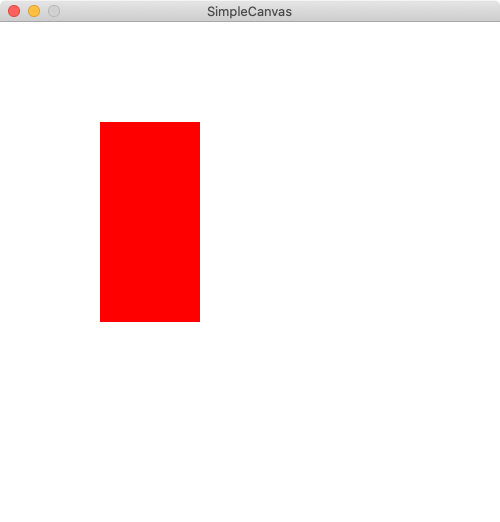

<script src="https://cdn.mathjax.org/mathjax/latest/MathJax.js?config=TeX-AMS-MML_HTMLorMML" type="text/javascript"></script>

# CS 142 Project 3: Animation Exploration
{: .no_toc }

1. TOC
{:toc}

For this project, you will write a program that allows you to model polygons 
and animations in an object-oriented style.  The end result will be a collection
of classes that, when put together, allows you to build animations on the screen
out of polygons that move in certain ways at certain times, like this:

<video controls>
  <source src="full-anim.mp4" type="video/mp4">
Your browser does not support the video tag.
</video>

The final product will be creating the above animation (or something comparable) 
programmatically, using classes that you design.  Along the way you will create other 
simpler animations.

## Starter code

**Make sure you create the project in a place on your computer where you can find it!
I suggest making a new subfolder in your CS 142 projects folder.**

You can download the starter code for this assignment by creating a new IntelliJ
project from version control (VCS) and using the following URL:

`https://github.com/pkirlin/cs142-f22-proj3`

## Guide to the classes

In this project, you will design a number of classes that represent polygons, 
groups of polygons, and animations of these polygons.  The classes you will write
are:

- `Polygon`: A polygon represents a shape drawn with a sequence of connected line segments.
Each polygon is defined by a sequence of (x, y) points, and the boundary of the polygon
is formed by connecting the points in sequence.  For instance, a triangle `Polygon` would
have three points, a rectangle four, etc.  A `Polygon` also knows what color it is
so it can be drawn on the canvas.

  Polygons also have the ability to be *translated* and *rotated*:  
  
  A [*translation*](https://en.wikipedia.org/wiki/Translation_(geometry))
is simply changing the location of the polygon; it is shifted a certain amount in the x direction and a certain 
amount in the y direction.  This does not change the polygon's overall shape, size, or orientation.

  A  [*rotation*](https://en.wikipedia.org/wiki/Rotation_(geometry)) means rotating the 
polygon around a fixed point, which does not have to be part of the polygon itself.  This changes
the location of the polygon, but also might change its orientation.  Its shape and size are not changed.

- `ComboPolygon`: A "combo polygon" represents a collection of `Polygon` objects that form some
combined shape that should be treated as one unit.  
They also have the ability to be translated and rotated: when a translation or
rotation is applied to a `ComboPolygon` that operation is simply passed along to each `Polygon` that
makes up the `ComboPolygon`.

- `TranslationAnimation` and `RotationAnimation`: These two classes represent a translation or rotation
animation applied to a specific `ComboPolygon`.  These classes store information about how an 
animation takes place over time, in that both classes store a time (in milliseconds) that the animation starts, and
a time that the animation ends.  In this way, one can represent, for instance, a 90-degree rotation
that begins at time 1000ms and ends at time 3000ms (for an animation that lasts 2 seconds in total).  

- `AnimationSequence`: This class represents a collection of animations applied to various 
`ComboPolygons`.  Each animation may be a translation or rotation, and can begin and end at any time.
This class is in charge of playing the animations at the appropriate times so they all are timed
correctly and animate appropriately.

## Guide to the math

This project requires some understanding of translations and rotations in geometry and
how they are applied to a polygon.

**Translations** are straightforward.  A translation means moving every point in a polygon
a fixed distance in the x direction, and a fixed distance in the y direction.  The distances
in the x and y directions need not be the same, and they may be zero (for instance, to shift
the polygon perfectly left, right, up or down).  

Mathematically, just add the translation's x distance and y distance to each point
in the polygon.  Note that in computer graphics, the y-axis is "flipped", so a translation
of 10 in the y-direction increases all the y coordinates in the polygon by 10, and
therefore moves the polygon *down* the screen.

**Rotations** are more complicated.  Our rotations are defined by an angle measured in 
degrees, along with an (x, y) point that we will rotate around.  The point is required information
because rotating, for instance, a square 90 degrees around its center point does not change the square
in any visible way (see the red square below), 
but rotating the same square around one of its corners shifts its location on the screen (see the blue
square, which is rotating around its lower-left corner).

<video controls width="255">
  <source src="squares-rotation.mp4" type="video/mp4">
Your browser does not support the video tag.
</video>

To rotate a polygon around a point, we will apply the steps below to each point of
the polygon.  To rotate a point of a polygon $$(x, y)$$ around another point $$(a, b)$$ by some
angle $$t$$, do the following:

- Assuming the angle $$t$$ is in degrees, is must be converted into radians.  Do this by 
multiplying $$t$$ by $$\pi/180$$.
- Translate $$(x, y)$$ by $$(-a, -b)$$.  That is, subtract $$a$$ from $$x$$ and $$b$$ from $$y$$.
- Set $$x_2 = x \cdot \cos(t) - y \cdot \sin(t)$$.
- Set $$y_2 = x \cdot \sin(t) + y \cdot \cos(t)$$.
- Translate $$(x_2, y_2)$$ by $$(a, b)$$.  That is, add $$a$$ to $$x_2$$ and $$b$$ to $$y_2$$.
- The new rotated point is $$(x_2, y_2)$$.

## How to develop the project

This project is organized around writing one class at a time and testing it.  Unlike previous projects,
there is no specific `main()` method to write; rather there is a file called `Tests.java` that you 
will use to write tests for each class as you develop them, and also contains a final animation that
should reproduce the video above.  **The guide below indicates the required tests you must write,
but you should feel free to add more!**

### The Polygon class

This class already has the instance variables and a few methods written
for you.  The way this class is supposed to work is that the constructor is provided with the number of 
points the polygon will *eventually* contain, and the color of the polygon.  However, the actual
coordinates of the points aren't provided in the constructor, they will be added through calling the 
`addPoints()` function.  

**Note**: The points of a polygon are represented here as `double`s, even
though we will only ever have use integer coordinates.  The reason for this is that when we start
animating the polygons, it is possible that the translation and rotation math will require 
some polygons to *temporarily* be
placed at non-integer coordinates, so therefore we just store all points as doubles.  

Example usage of this class:
  
```java
Polygon rectangle = new Polygon(4, Color.RED);
rectangle.addPoint(100, 100);
rectangle.addPoint(200, 100);
rectangle.addPoint(200, 300);
rectangle.addPoint(100, 300);
```

Because we are storing the x and y coordinates in arrays, when a new point is
added to the polygon, we have to know what index in these arrays the point should go into.  This is
maintained through the `nextIndex` variable.  Notice how in the constructor, `nextIndex` is initialized to zero.
Whenever `addPoint()` is called, it should place the new x and y coordinates (that it is given as parameters)
into the `xpoints` and `ypoints` arrays at the index `nextIndex`.  Then it should increment `nextIndex`
so that the *next* call to `addPoint()` will put its points into the array one index to the right.  You 
do not have to check for `addPoints()` being called too many times, though you may.

**Suggested order of writing methods**
	
Before writing **any** methods, familiarize yourself with the instance variables
of the class and envision how the methods will work with them.   Note that the
constructor and the `drawOn()` method are already written for you.

- `addPoint()`: Write this first.  This method takes a new (x, y) point to add to the polygon.

- `toString()`: Write this next.  This method should return a `String` starting with 
the word `Polygon:`, and then be followed by all the points of the polygon.  
You can include the color of the Polygon if you want.  Remember, this method should *return* the `String`,
not print it.  Hint: Use `Arrays.toString()` to turn an array into a `String`.  

- **Stop and test**.  In `Tests.java`, run `testPolygons()`.  This test function creates a red rectangle, 
prints it out, and displays it on a sample canvas.  The polygon's string representation should be something like:

	`Polygon: [100.0, 200.0, 200.0, 100.0] [100.0, 100.0, 300.0, 300.0]`
	
	The canvas should look like this:
	
	
	
	Then, create a second polygon in the test function, print it out, and draw it on the canvas.
	Verify that it is printed and drawn correctly.

- `translate()`: Write this next.  This method takes two `double`s, `distx` and `disty`, and should
translate the polygon by these distances in the x and y directions.  Note: This has nothing to do
with the animations; these translations should happen "instantly" when the method is called.

- **Stop and test**.  In `Tests.java`, comment out the call to `testPolygons()` in `main()`, and 
uncomment the call to `testTranslation()`  This test function creates a red rectangle, 
prints it out, then translates it twice, and prints it out after each translation.  The output
should be:

	```
	Polygon: [100.0, 200.0, 200.0, 100.0] [100.0, 100.0, 300.0, 300.0]
	Polygon: [110.0, 210.0, 210.0, 110.0] [120.0, 120.0, 320.0, 320.0]
	Polygon: [80.0, 180.0, 180.0, 80.0] [80.0, 80.0, 280.0, 280.0]
	```
	
	The test function also asks you to create a second polygon and test its translation.

- `rotateAround()`: Write this next.  This method takes a point and an angle (in degrees)
and should rotate the polygon around the given point by the specified number of degrees.
Follow the math above to write this method, adjusting each point of the polygon.

	Note that if `degrees` is positive, the rotation is clockwise, and if its negative, the
rotation is counter-clockwise.  (This happens automatically with the math, you don't have
to do anything special for this.)

- **Stop and test**.  In `Tests.java`, write a function called `testRotations()` that
works similarly to `testTranslations()`.  You should create a polygon and rotate
it a few times, and verify the rotations work as they should.  You can make up examples
or find some online (there are lots of videos that walk through the math, and you can use
their examples if you don't want to make up your own.)

    An alternate way to test is to test the rotations on a canvas.  In your testRotations()
    function, you can create a polygon, display it on a canvas with `drawOn()`, wait for a mouse click (or
    pause the canvas), rotate the polygon, then re-display it on the same canvas with
    another call to `drawOn()`.  Don't forget
    to call update() on the canvas after the rotation to get the picture to change.  
    You can also call `clear()` on the canvas to erase it before displaying the rotation,
    or leave it out to display the pre-rotation and post-rotation images.
    
Polygon is now done!

### The ComboPolygon class

This class is left mostly blank, but the implementation of a `ComboPolygon`
is very similar to regular `Polygon`s, in that their job is mostly to manage
arrays.  A `Polygon` manages two arrays of doubles, while a `ComboPolygon` will manage
a single array of `Polygon`s.  Notice how the instance variables in `ComboPolygon` parallel
a few of the instance variables in `Polygon`, and how similar the constructors are.

Most of the methods in this class simply "pass along" their commands to each individual
polygon within the `ComboPolygon`.  For instance, how do you translate a ComboPolygon?
You simply call translate with the same arguments on each individual `Polygon` in the
`polys` array.  Same with rotateAround() and drawOn().  

**Suggested order of writing methods**

- `addPolygon()`: Write this first.  This method takes a new `Polygon` to add to the ComboPolygon.
This is just like `addPoint()` in `Polygon`.

- `toString()`: Write this next.  This method can simply return whatever `Arrays.toString()`
returns for the `polys` array.
Remember, this method should *return* the `String`,
not print it.  

- **Stop and test**.  In `Tests.java`, run `testComboPolygons()`.  This test function creates a combination
polygon of four differently-colored squares and prints it out.  The drawing won't work yet
because we haven't written `drawOn()`, but if you've written `toString()` correctly, you should
see something like:

    `ComboPolygon: [Polygon: [140.0, 180.0, 180.0, 140.0] [140.0, 140.0, 180.0, 180.0], Polygon: [180.0, 220.0, 220.0, 180.0] [180.0, 180.0, 220.0, 220.0], Polygon: [180.0, 220.0, 220.0, 180.0] [140.0, 140.0, 180.0, 180.0], Polygon: [140.0, 180.0, 180.0, 140.0] [180.0, 180.0, 220.0, 220.0]]`
 
- `drawOn()`: Write this next.  Use a `for` loop to call `drawOn()` on each Polygon
in the ComboPolygon, passing along the same arguments the method was called with.

- **Stop and test**.  At this point, you should be able to see the ComboPolygon drawn
on the screen while testing.
	   
- `translate()`: Write this next.  Use a `for` loop to call `translate()` on each Polygon
in the ComboPolygon, passing along the same arguments the method was called with.

- **Stop and test**.  In `Tests.java`, either add some code in `testComboPolygons()` to 
test the translation method, or write a new test function.  

- `rotateAround()`: Use a `for` loop to call `rotateAround()` on each Polygon
in the ComboPolygon, passing along the same arguments the method was called with.

- **Stop and test**.  In `Tests.java`, either add some code in `testComboPolygons()` to 
test the rotation method, or write a new test function.  

ComboPolygon is now done!

### The TranslationAnimation class

This class manages an **animation** of a translation, which is formed by splitting
a single translation into pieces that take place over time.  

First, a quick tutorial about how animation works.  Motion in TV and film is of course,
an illusion.  Videos that appear to display moving pictures are actually displaying a sequence of images, 
called "frames," very quickly in sequence,
where each frame contains a still image.  By making sure the images differ from each
other only minimally, and by only pausing for a fraction of a second while displaying each frame, our eyes
interpret the sequence of non-moving images as moving pictures.  ([More info](https://en.wikipedia.org/wiki/Animation).) 

Typically, our eyes can only perceive 10-12 frames per second as visually distinct, whereas anything
faster is perceived as motion.  Various video and TV standards typically use somewhere between 24-60
frames per second.  ([More info](https://en.wikipedia.org/wiki/Frame_rate).) 
Our animations, to make the math easier, will use 50 frames per second, which means
each frame of our animations will be displayed for 1/50th of a second, which is 20 milliseconds (ms).

Here's a full example.  Suppose we wish to translate the point (100, 100) by 100 pixels 
in the x direction and 200 pixels in the y direction, and this animation should last 2 seconds (2000ms).
(Note that this example uses a single point, but all the math can be extrapolated to apply to a Polygon
or ComboPolygon).  Because the animation lasts 2000ms, and each frame of the animation will be displayed for
20ms, we know that there are 100 total frames in the animation.  Now we have to figure out how much each
frame changes from the previous one.  To do this, we divide up the total distance of the translation (separately
for x and y) over each frame.  So the x coordinate is changing by 100 pixels over 100 frames, so the point
moves one pixel in the x direction for each frame.  Similarly, the y coordinate is changing by 200 pixels
over 100 frames, so the point moves two pixels in the y direction for each frame.  In this way, the total 
translation is divided into 100 mini-translations, each one moving the polygon by 1 pixel in the x direction
and 2 pixels in the y direction.

All of this information is stored and managed in the TranslationAnimation class.
In particular, this class maintains variables to store the total change in the x and y directions,
the time the animation starts and ends, and the ComboPolygon the animation is run on.  Note that
start and end times are used rather than a single "duration" so that later on we can have animations
start at different times.

**Suggested order of writing methods**

- Write `advanceToNextFrame()` first.  This method should calculate
the individual x and y distances for **one** frame of animation and then call your translation
function you wrote earlier to make the change.

- **Stop and test**: Fill in the testTranslationFrames() test code in Tests.java to 
test your advanceToNextFrame() method.  Code is already written for you that 
creates a very small test animation that mirrors the example given above.  You should
add code to advance the ComboPolygon to the next frame a few times, and print it out
after each advancement.  Make sure the points of the polygon are being translated correctly.

- Now write `playOn()`.  This method displays the full animation, frame by frame, on a canvas.
There is pseudocode in the method to follow.  There is already a test function written:
testTranslationAnimation().  The final result should be this:

<video controls>
  <source src="translation.mp4" type="video/mp4">
Your browser does not support the video tag.
</video>

### The RotationAnimation class

This class mirrors the TranslationAnimation class, but is for rotations instead.  Everything from
above applies here; the only difference is that instead of having a translation x distance and
y distance to divide into a certain number of frames, we have a rotation angle that needs to
be divided instead.

So write this class following the model above.  When you're all done, you should be able
to run testRotationAnimation() and see the following:

<video controls>
  <source src="rotation.mp4" type="video/mp4">
Your browser does not support the video tag.
</video>


### The AnimationSequence class

This class is the last class!  It manages a collection of translation and rotation
animations, each one running at different times.  

**Suggested order of writing methods**

- Write addTranslation() and addRotation() first.  These should add a TranslationAnimation
or RotationAnimation to the appropriate array.

- Write getMaxTime() next.  This should examine all the animations in the class and return
the maximum ending time.  This is therefore the total length of the entire animation sequence.

- Write playOn() last.  This is the final method of the project!  This method should act
similarly to the playOn() methods in the animation classes, but it can't just call them directly.
The reason is because we need the animations to all run simultaneously if they overlap in time.

    So the strategy to use here is to write a loop, similar to the ones in the animation classes
    that iterates through the a time variable by 20 millisecond increments.  Then, inside that
    loop, we will have two other loops that iterate through the translation animations and the
    rotation animations, checking each one to see if we should advance to the next frame
    of the animation.  Follow the pseudocode in the method.
    
- When you're all done, you should be able to run the testFullAnimation() test case,
and it should reproduce the video at the top of this project.
    
## What to turn in

- Through Canvas, turn in all your `.java` files.  
Additionally, upload a text file answering the following questions:

1. What bugs and conceptual difficulties did you encounter? How did you overcome them? What did you learn?
2. Describe whatever help (if any) that you received. Don’t include readings, lectures, and exercises, 
but do include any help from other sources, such as websites or people (including classmates and friends) 
and attribute them by name.
3. Describe any serious problems you encountered while writing the program.
4. Did you do any of the challenges (see below)? If so, explain what you did.
5. List any other feedback you have. Feel free to provide any feedback on how much you 
learned from doing the assignment, and whether you enjoyed doing it.


    
## Challenges

- Add other types of animations, such as growing or shrinking a polygon (scaling it up or down),
or a combination translation/rotation animation that does both at the same time (this would be necessary,
for example, for an animation of a bicycle wheel that rolls along the ground, because it is simultaneously
rotating and being translated).

- Create an animation of your choice, similar in complexity to the full animation at the 
end of this project.  Points will be given for creativity and complexity!

